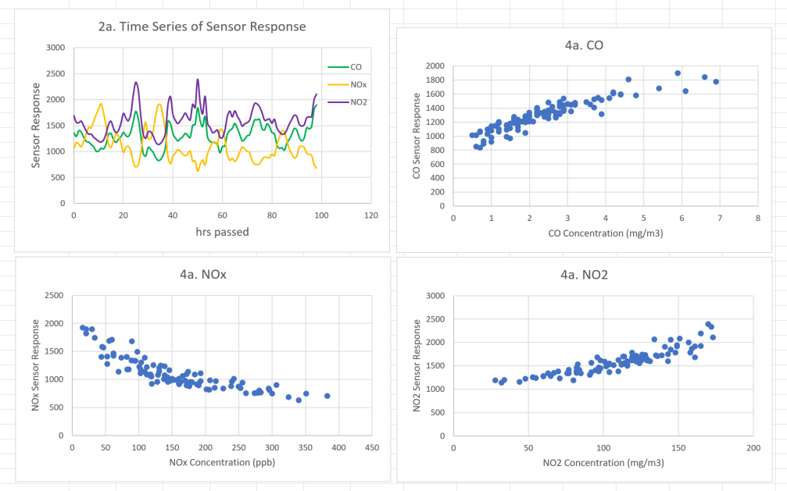
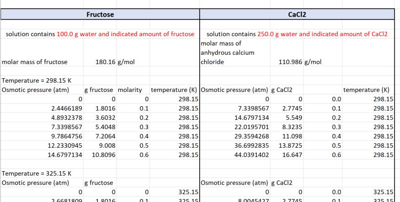
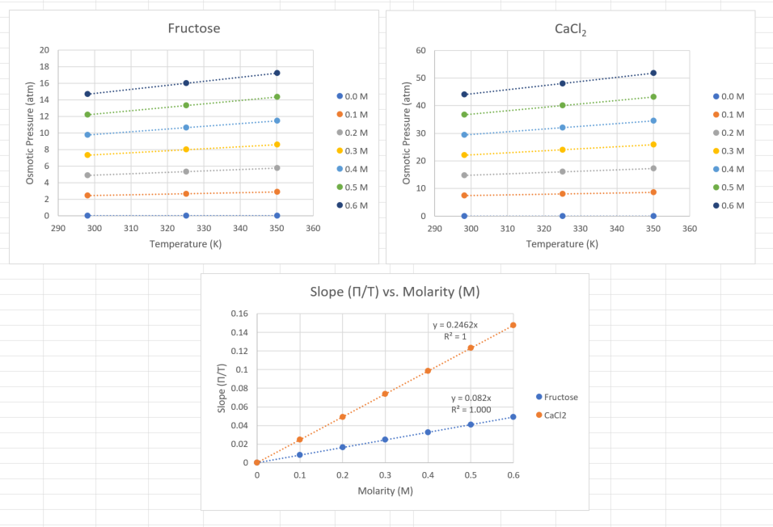

## Samples 

### statsExcel.xlsx
Excel data analysis exercise I have created for "Engineering Statistics" course.

### CHM301sample.xlsx  
Microsoft Excel data analysis sample used in the CHM301 Fundamentals of Physical Chemistry course.  

  

### gradesIFExcel.xlsx
Grades analysis exercise I have created for "Engineering Computations" course.

**MSdeconvSample.xlsx**  
Microsoft Excel data analysis done as a postdoc at UCR: deconvoluting mass spectrometer signals

